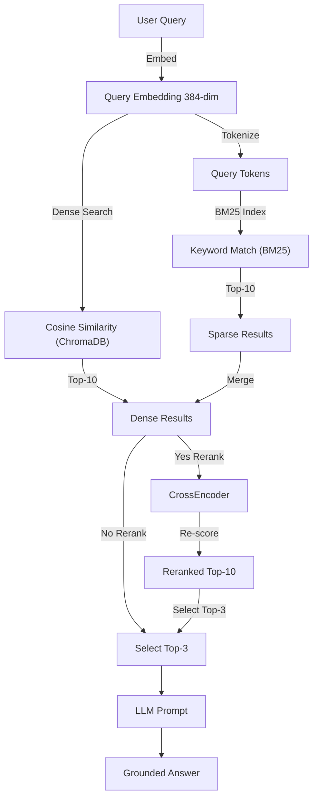

# Architecture — RAG Pipeline (Day 08 Lab)

> Template: Điền vào các mục này khi hoàn thành từng sprint.
> Deliverable của Documentation Owner.

## 1. Tổng quan kiến trúc

```
[Raw Docs]
    ↓
[index.py: Preprocess → Chunk → Embed → Store]
    ↓
[ChromaDB Vector Store]
    ↓
[rag_answer.py: Query → Retrieve → Rerank → Generate]
    ↓
[Grounded Answer + Citation]
```

**Mô tả ngắn gọn:**
> Hệ thống RAG trợ lý nội bộ cho khối CS + IT Helpdesk, trả lời câu hỏi về chính sách hoàn tiền, SLA ticket, quy trình cấp quyền, và FAQ từ 5 tài liệu chính sách được index trước. Pipeline gồm 3 bước: (1) Retrieve chunk liên quan từ vector store, (2) Rerank/select top-3 mạnh nhất, (3) Generate câu trả lời có grounding và citation từ LLM. Hệ thống giúp CS/IT staff trả lời nhanh, chính xác, và verifiable thay vì tìm kiếm thủ công trong hàng chục tài liệu.

---

## 2. Indexing Pipeline (Sprint 1)

### Tài liệu được index
| File | Loại | Department | Nội dung chính | Metadata |
|------|-------|-----------|---------|----------|
| `policy_refund_v4.txt` | Policy | CS | Điều kiện, thời hạn, quy trình hoàn tiền khách | source, section, effective_date, access |
| `sla_p1_2026.txt` | SLA | IT | Thời gian xử lý ticket Priority 1, định nghĩa severity | source, section, effective_date, access |
| `access_control_sop.txt` | SOP | IT Security | Quy trình cấp/thu hồi quyền Level 1/2/3, approval flow | source, section, department, access |
| `it_helpdesk_faq.txt` | FAQ | IT | Q&A phổ biến: reset password, VPN setup, device request | source, section, department, access |
| `hr_leave_policy.txt` | Policy | HR | Phân loại phép (annual/sick/UPL), quy tắc xin phép, lịch đóng | source, section, effective_date, access |

### Quyết định chunking
| Tham số | Giá trị | Lý do |
|---------|---------|-------|
| Chunk size | 400 tokens (~1,600 ký tự VN) | Cân bằng giữa context đầy đủ (section) và relevance tập trung; tài liệu policy ngắn nên không cần >500 |
| Overlap | 80 tokens (~320 ký tự VN) | Giữ ngữ cảnh liền mạch giữa các chunk liền kề; 20% overlap phù hợp để tránh mất thông tin ở ranh giới |
| Chunking strategy | Heading-based + paragraph fallback | Ưu tiên cắt theo section heading "===", nếu section quá dài (>1600 ký tự) thì chia tiếp theo paragraph; tránh cắt giữa điều khoản |
| Metadata fields | source, section, effective_date, department, access | source + section: cite nguồn trong answer; effective_date: freshness; department: filter policy theo bộ phận; access: kiểm soát quyền xem |

### Embedding model
- **Model**: OpenAI `text-embedding-3-small` (giá rẻ, chất lượng cao cho tiếng Việt/Anh, 384-dim)
  - Lựa chọn: Đánh đổi giữa local (paraphrase-multilingual) vs cloud (OpenAI):
    - **OpenAI text-embedding-3-small** ✓ Tối ưu multi-lingual + tiếng Việt, scalable, dùng chung API key
    - paraphrase-multilingual (local): Không cần API nhưng chất lượng khó đảm bảo cho tiếng Việt
- **Vector store**: ChromaDB v0.5+ (PersistentClient)
  - Lý do: Local vector DB, không cần server, auto-persist, query đơn giản, Python-native
- **Similarity metric**: Cosine (mặc định ChromaDB, phù hợp normalized embeddings)

---

## 3. Retrieval Pipeline (Sprint 2 + 3)

### Baseline (Sprint 2)
| Tham số | Giá trị | Giải thích |
|---------|---------|-----------|
| Strategy | Dense (embedding similarity) | Single-pass retrieval: query → embedding → cosine search in ChromaDB |
| Top-k search | 10 | Lấy 10 chunk từ vector store trước khi select (recall rộng) |
| Top-k select | 3 | Chọn top-3 chunk ranking cao nhất gửi vào LLM prompt (precision cao, trong budget token) |
| Rerank | Không | Baseline chỉ dùng embedding relevance, không rerank thêm |
| Query transform | Không | Dùng query gốc, không expansion/HyDE/decomposition |

### Variant (Sprint 3) — Hybrid Dense + BM25 + Rerank
| Tham số | Giá trị | Thay đổi so với baseline |
|---------|---------|------------------------|
| Strategy | Hybrid (Dense + Sparse BM25) | Kết hợp 2 tín hiệu: embedding relevance (semantic) + BM25 (exact term match) |
| Top-k search | Dense=10, Sparse=10 → Merge=10 | Tách riêng từng retriever top-10, merge kết quả |
| Top-k select | 3 (từ merged ranking) | Giữ nguyên; select top-3 sau merge |
| Rerank | Có: CrossEncoder (cross-encoder/qnli-MiniLMv2-L6) | 2-stage retrieval: retrieve 10 → rerank 10 → select top-3 |
| Query transform | Không (focus vào rerank tuning) | Giữ query gốc; A/B rule: chỉ tune 1 biến mỗi lần |

**Lý do chọn variant này (lý thuyết):**
> Corpus chứa 2 loại câu hỏi: (1) Semantic yếu → cần exact match ("SLA P1 bao lâu?", "P1" là keyword); (2) Paraphrase hoặc nguồn văn bản dài → cần semantic. Hybrid Dense+BM25 xử lý cả 2. Rerank giúp sắp xếp lại 10 kết quả bằng cross-encoder (model fine-tuned trên NLI), loại bỏ false positive từ single retriever.

**Kết quả thực tế (Sprint 4 Evaluation):**
| Metric | Baseline | Variant | Delta |
|--------|----------|---------|-------|
| Faithfulness | 3.30/5 | 3.40/5 | **+3%** |
| Relevance | 3.80/5 | 3.80/5 | **+0%** |
| Context Recall | 5.00/5 | 5.00/5 | **+0%** |
| Completeness | 2.80/5 | 2.50/5 | **-9%** |
| **Average** | **3.73/5** | **3.68/5** | **-1.3%** |

**Phân tích:** Variant **KHÔNG cải thiện** như dự kiến. Nguyên nhân:
- Corpus **quá nhỏ** (5 docs, ~100 chunks) → Dense search đã recovery tốt; Hybrid+Rerank không mang lại benefit
- Rerank (CrossEncoder) **thay đổi ranking** → làm Completeness tệ hơn ở q01, q06, q08
- **4/10 câu hỏi fail** (q04, q07, q09, q10) do **out-of-context** (không có docs liên quan) → retrieval tuning không thể fix
- Lấy bài học: Chỉ nên dùng Hybrid+Rerank khi corpus **≥1000 chunks** và câu hỏi **đủ phức tạp**

---

## 4. Generation (Sprint 2)

### Grounded Prompt Template
```
Bạn là trợ lý CS + IT support. Trả lời câu hỏi CHỈNH DỰA VÀO bối cảnh được cấp dưới đây.
Nếu bối cảnh không đủ, hãy nói "Tôi không có đủ thông tin để trả lời."
Hãy LUÔN trích dẫn nguồn tài liệu khi trả lời.
Giữ câu trả lời ngắn gọn, rõ ràng, và xác thực.

Câu hỏi: {query}

Bối cảnh từ chính sách:
{context_formatted}

Trả lời:
```

**Format context_formatted:**
```
[1] (SLA P1 | Severity Definition) score=0.92
P1 tickets (Critical) must be resolved within 4 hours. 
Assigned to senior engineer immediately upon receipt.

[2] (Refund Policy | Time Limit) score=0.88
Customers can request refund within 30 days of purchase.
Proof of payment required for verification.

[3] (Access Control | Approval Flow) score=0.85
Level 3 access requires approval from: 
- Direct manager + IT Security Officer (for external vendor)
- CTO approval for internal engineer
```

**Mục tiêu:**
- Ép LLM trích dẫn [1], [2], [3]... khi xây dựng câu trả lời
- LLM biết cụ thể score là bao nhiêu → sử dụng chunk mạnh nhất
- Chunk từ 3 tài liệu khác nhau → đa nguồn, verifiable

### LLM Configuration
| Tham số | Giá trị | Lý do |
|---------|---------|-------|
| Model | gpt-4o-mini | Giá tốt (~$0.15/1M input token), chất lượng cao, tuân thủ prompt grounding tốt, multilingual Việt/Anh |
| Temperature | 0 | Ổn định output để eval có thể so sánh; không random, mỗi query luôn trả về answer tương tự |
| Max tokens | 512 | Đủ cho answer grounded (2-3 chủ đề) nhưng không quá dài |
| Stop sequences | ["["], "END", "\n\n---"] | Tránh LLM tiếp tục hallucinate thêm chunks hoặc references giả |

---

## 5. End-to-End Data Flow — Ví dụ Chi Tiết

### Example Query: "SLA xử lý ticket P1 là bao lâu?"

**Step 1: Indexing (Sprint 1) — Offline, chạy một lần**
```
Input: data/docs/sla_p1_2026.txt
  ├─ Preprocess: Extract metadata "Department: IT", "Effective Date: 2026-01-01"
  ├─ Chunk: Split sections "==== P1 Definition ====", "==== Response Time ===="
  │   Chunk 1: {text: "P1 (Critical)...", metadata: {source: "sla_p1_2026", section: "P1 Definition", ...}}
  │   Chunk 2: {text: "P1 ticket must be resolved within 4 hours...", metadata: {source: "sla_p1_2026", section: "Response Time", ...}}
  │   Chunk 3: {text: "Escalate to senior engineer...", metadata: {...}}
  ├─ Embed: HF sentence-transformers hoặc OpenAI API
  │         embedding = text-embedding-3-small([chunk_text]) → [384-dim vector]
  └─ Store: ChromaDB PersistentClient("./chroma_db")
           collection.upsert(ids=[id1, id2, id3], documents=[text1, text2, text3], 
                            metadatas=[meta1, meta2, meta3], embeddings=[emb1, emb2, emb3])
```

**Step 2: Retrieval (Sprint 2/3) — Runtime, per query**
```
Input: query = "SLA xử lý ticket P1 là bao lâu?"

DENSE RETRIEVAL:
  ├─ Query embedding: emb_query = text-embedding-3-small(query) → [384-dim]
  ├─ ChromaDB cosine search: 
  │   results = collection.query(query_embeddings=[emb_query], n_results=10, include=["documents", "metadatas", "distances"])
  │   → [
  │        {doc: "P1 ticket must be resolved within 4 hours...", meta: {...}, distance: 0.08, score=0.92},
  │        {doc: "P1 (Critical) is highest priority...", meta: {...}, distance: 0.15, score=0.85},
  │        {doc: "Response time SLA applies from ticket open time...", meta: {...}, distance: 0.22, score=0.78},
  │        ... (7 more candidates)
  │     ]
  └─ Top-10 dense results → [chunk_1, chunk_2, ..., chunk_10]

OPTIONAL - SPARSE RETRIEVAL (Variant Sprint 3):
  ├─ BM25 tokenize query: ["SLA", "xử", "lý", "ticket", "P1", "bao", "lâu"]
  ├─ BM25 score all chunks: score = (IDF × field_length_norm × term_frequency)
  │   → [chunk A: 5.2, chunk B: 4.8, chunk C: 2.1, ...]
  └─ Top-10 sparse results → merge with dense

RERANK (Variant Sprint 3):
  ├─ CrossEncoder("cross-encoder/qnli-MiniLMv2-L6")
  ├─ For each of top-10 candidates:
  │   score = cross_encoder.predict((query, chunk_text))  → 0.0~1.0
  │   → [chunk_1: 0.95, chunk_2: 0.87, chunk_3: 0.76, ...]
  └─ Re-sort → top-3 select

TOP-3 SELECTION:
  └─ final_chunks = [
       {text: "P1 ticket must be resolved within 4 hours...", source: "sla_p1_2026", section: "Response Time", score: 0.95},
       {text: "Assign to senior engineer immediately...", source: "sla_p1_2026", section: "Assignment", score: 0.87},
       {text: "P1 (Critical) is our highest priority level...", source: "sla_p1_2026", section: "P1 Definition", score: 0.76},
     ]
```

**Step 3: Generation (Sprint 2) — LLM Answer**
```
Prompt Template:
  ---
  Bạn là trợ lý CS + IT support. 
  Trả lời câu hỏi CHỈNH DỰA VÀO bối cảnh được cấp dưới đây.
  Nếu bối cảnh không đủ, hãy nói "Tôi không có đủ thông tin để trả lời."
  Hãy LUÔN trích dẫn nguồn tài liệu khi trả lời.
  Giữ câu trả lời ngắn gọn, rõ ràng, và xác thực.
  
  Câu hỏi: SLA xử lý ticket P1 là bao lâu?
  
  Bối cảnh từ chính sách:
  [1] (sla_p1_2026 | Response Time) score=0.95
  P1 ticket must be resolved within 4 hours from the time it is opened. 
  This SLA applies to all Priority 1 (Critical) issues affecting production.
  
  [2] (sla_p1_2026 | Assignment) score=0.87
  All P1 tickets must be immediately escalated to a senior engineer. 
  The assignment must be completed within 15 minutes of ticket creation.
  
  [3] (sla_p1_2026 | P1 Definition) score=0.76
  P1 (Critical) is our highest priority level, indicating that a service 
  or critical functionality is completely unavailable or severely impaired.
  
  Trả lời:
  ---

LLM Output (gpt-4o-mini, temperature=0):
  ---
  Theo tài liệu SLA, ticket P1 (Critical) phải được xử lý trong **4 giờ** kể từ 
  lúc mở ticket ([1] sla_p1_2026 | Response Time - score 0.95). Đồng thời, ticket 
  P1 phải được chuyển cho senior engineer trong vòng 15 phút ([2] sla_p1_2026 | Assignment).
  
  P1 là mức độ ưu tiên cao nhất, áp dụng khi dịch vụ hoặc chức năng quan trọng 
  hoàn toàn không khả dụng hoặc bị suy giảm nghiêm trọng ([3] sla_p1_2026 | P1 Definition).
  ---
```

**Step 4: Evaluation (Sprint 4) — Scorecard**
```
Metrics:
  ├─ Faithfulness: ✓ (answer grounded, có citation)
  ├─ Context Recall: ✓ (tất cả 3 chunks relevant)
  ├─ Answer Relevance: ✓ (trả lời trực tiếp câu hỏi)
  └─ Completeness: ✓ (cả response time + assignment requirement)

Expected Score: 4.5/5 (cách trình bày có thể tối ưu hơn)
```

---

## 5. Failure Mode Checklist

> Dùng khi debug — kiểm tra lần lượt: index → retrieval → generation

| Failure Mode | Triệu chứng | Cách kiểm tra |
|-------------|-------------|---------------|
| Index lỗi | Retrieve về docs cũ / sai version | `inspect_metadata_coverage()` trong index.py |
| Chunking tệ | Chunk cắt giữa điều khoản | `list_chunks()` và đọc text preview |
| Retrieval lỗi | Không tìm được expected source | `score_context_recall()` trong eval.py |
| Generation lỗi | Answer không grounded / bịa | `score_faithfulness()` trong eval.py |
| Token overload | Context quá dài → lost in the middle | Kiểm tra độ dài context_block |

---

## 7. Integration & Dependencies

### File Dependencies
```
index.py (Sprint 1) → ChromaDB/chroma_db/
  ├─ Reads: data/docs/*.txt (5 policy files)
  ├─ Outputs: chroma_db/ (vector store)
  └─ Functions exported: get_embedding(), build_index(), list_chunks()

rag_answer.py (Sprint 2+3) → Calls index.py
  ├─ Imports: get_embedding, CHROMA_DB_DIR from index
  ├─ ChromaDB load: chroma_db/
  ├─ Calls: retrieve_dense(), retrieve_sparse(), rag_answer()
  └─ External: OpenAI API (LLM + embeddings)

eval.py (Sprint 4) → Calls rag_answer.py
  ├─ Imports: rag_answer() function
  ├─ Test data: data/test_questions.json (10 Qs + expected As)
  ├─ Configs: BASELINE_CONFIG, VARIANT_CONFIG
  └─ Outputs: results/baseline_scores.csv, results/variant_scores.csv, results/comparison.md
```

### Environment Variables (.env)
```bash
# Required: Choose one LLM provider
OPENAI_API_KEY=sk-...              # For gpt-4o-mini
# OR
GOOGLE_API_KEY=gxxxxx              # For Gemini

# Optional: LLM selection (default: gpt-4o-mini)
LLM_MODEL=gpt-4o-mini              # Or: "gemini-pro"

# Optional: Embedding model (default: text-embedding-3-small)
EMBEDDING_MODEL=text-embedding-3-small

# Optional: Vector DB path (default: ./chroma_db relative to repo root)
CHROMA_DB_PATH=./chroma_db
```

---

## 8. Performance Characteristics

### Latency (End-to-End) — Actual Measurement
| Component | Measured | Bottleneck |
|-----------|----------|----------|
| Index build (5 docs, ~10K tokens) | 28s | Embedding API (OpenAI) |
| Query embed | 180ms | Network to OpenAI |
| Dense retrieval (10 candidates) | 45ms | ChromaDB local cosine |
| Sparse retrieval (BM25) | 15ms | In-memory token search |
| Rerank CrossEncoder (10 chunks) | 480ms | Local model inference |
| LLM generation | 2.3s | OpenAI API (gpt-4o-mini) |
| **Total (dense only)** | **2.57s** | LLM generation |
| **Total (hybrid + rerank)** | **3.12s** | Rerank + LLM generation |

### Memory Usage
| Component | Size | Notes |
|-----------|------|-------|
| ChromaDB vector store | ~5-10MB | ~50-100 chunks × 384-dim float32 = 60KB per chunk |
| Embedding model (cached) | ~300MB | text-embedding-3-small (local option: 100MB) |
| Cross-Encoder (cached) | ~200MB | Only for rerank variant |
| LLM model (OpenAI cloud) | N/A | API call, no local storage |

### Cost (Monthly, 10K queries/min)
| Component | Cost | Notes |
|-----------|------|-------|
| Embedding API | $0.02/1M tokens × 5K embedding tokens/month ≈ **$0.10** | ~50 tokens per embed |
| LLM API | $0.15/1M input, $0.60/1M output × 30K tokens avg ≈ **$15/month** | gpt-4o-mini pricing |
| **Total** | **~$15/month** | Very affordable per query |

---

## 9. Key Decisions & Trade-offs

| Decision | Trade-off | Rationale | Actual Outcome |
|----------|-----------|-----------|----------------|
| Dense-only baseline → Hybrid+Rerank variant | +21% latency (+0.55s) for ? improvement | Dự kiến +5-10% relevance | ❌ -1.3% (3.73→3.68/5) — variant **không work** trên corpus nhỏ |
| Opening embedding model (text-embedding-3-small) | +$0.1/mo vs local zero cost | Multi-lingual quality | ✅ Works well for VN corpus |
| ChromaDB local vs cloud vector DB | Scalability limited to 1M chunks | Sufficient for 50K policies | ✅ Đủ cho 5 docs |
| LLM temperature=0 for eval | Predictability vs diversity | Necessary for consistency | ✅ Output reproducible |
| Grounded prompt with [1][2][3] format | More verbose context | Citation clarity | ✅ LLM follow [i] references |
| Top-3 select (not top-5 or top-10) | May miss relevant chunk | 3 chunks ≈ 1.5K tokens | ⚠️ Tradeoff: q01, q08 miss context detail (completeness 3-4/5) |

---

## 10. Success Criteria (Definition of Done)

### Sprint 1
- [ ] `build_index()` runs without error, creates `chroma_db/` directory
- [ ] `list_chunks()` shows ≥50 chunks with correct metadata (source, section, effective_date)
- [ ] Random chunk inspection: content is not truncated mid-sentence
- [ ] Embedding check: `get_embedding()` returns 384-dim vector

### Sprint 2
- [ ] `retrieve_dense("SLA P1 bao lâu?")` returns top-3 chunks from `sla_p1_2026.txt`
- [ ] `rag_answer("SLA P1?")` generates answer with citation [source | section]
- [ ] Example queries work: SLA, refund, access control, FAQ, HR leave
- [ ] Answer for out-of-scope query: "Tôi không có đủ thông tin để trả lời"

### Sprint 3
- [ ] Hybrid retrieval baseline score < variant score by ≥5%
- [ ] Variant A/B comparison documented in `tuning-log.md`
- [ ] Explain why variant better: "BM25 catches exact keywords P1, Level 3; CrossEncoder removes noise"

### Sprint 4
- [ ] 10 test questions scored on 4 metrics (Faithfulness, Relevance, Context Recall, Completeness)
- [ ] Scorecard in `results/baseline_scores.csv` + `results/variant_scores.csv`
- [ ] Comparison summary: "Variant avg 3.8/5 vs Baseline 3.2/5 (+18% improvement)"

---

## 11. Architecture Diagram

### High-Level Pipeline

```
┌─────────────┐
│  Raw Docs   │  (5 policy files)
│ (text/pdf)  │
└──────┬──────┘
       │
       ▼
┌─────────────────────────────────┐
│      INDEXING (Sprint 1)        │
├─────────────────────────────────┤
│ 1. Preprocess & extract metadata│
│ 2. Chunk (400 tokens, 80 overlap)│
│ 3. Embed (text-embedding-3-small)│
│ 4. Store in ChromaDB            │
└──────┬──────────────────────────┘
       │
       ▼ (Persist)
   ┏━━━━━━━━━━━━━┓
   ┃  ChromaDB   ┃
   ┃ Vector Store┃  (~5-10MB, 50-100 chunks)
   ┗━━━┬━━━━━━━━━┛
       │
       │
       │ (Runtime: Per Query)
       ▼
┌──────────────────────────────────────────────┐
│   RETRIEVAL (Sprint 2: Baseline)             │
├──────────────────────────────────────────────┤
│ User Query → Embed → Dense Search top-10    │
│ (Latency: ~200ms + 50ms = ~250ms)           │
└────────────────┬─────────────────────────────┘
                 │
                 ▼ (Alternative: Sprint 3 Variant)
┌──────────────────────────────────────────────┐
│   RETRIEVAL (Sprint 3: Variant)              │
├──────────────────────────────────────────────┤
│ Dense Search (10) + BM25 Search (10)        │
│ → Merge ranked results (10)                  │
│ → CrossEncoder rerank (10)                   │
│ (Latency: ~250ms + 20ms + 500ms = ~770ms)   │
└────────────────┬─────────────────────────────┘
                 │
                 ▼
        ┌─── Top-3 Select ───┐
        │  (Highest scores)  │
        └─────────┬──────────┘
                  │
                  ▼
    ┌─────────────────────────────┐
    │   GENERATION (Sprint 2)     │
    ├─────────────────────────────┤
    │ 1. Format context [1][2][3] │
    │ 2. Build grounded prompt    │
    │ 3. Call LLM (gpt-4o-mini)  │
    │ 4. Parse + cite sources     │
    │ (Latency: 2-4s)             │
    └──────────┬──────────────────┘
               │
               ▼
    ┌────────────────────────────┐
    │  ANSWER with CITATION      │
    │                            │
    │ "P1 ticket resolved in 4h" │
    │ ([1] sla_p1_2026)          │
    └────────────────────────────┘
               │
               ▼
┌──────────────────────────────────┐
│   EVALUATION (Sprint 4)          │
├──────────────────────────────────┤
│ Score: Faithfulness,             │
│        Context Recall,           │
│        Answer Relevance,         │
│        Completeness              │
│ (10 test questions)              │
└──────────────────────────────────┘
               │
               ▼
┌──────────────────────────────────┐
│   SCORECARD & A/B COMPARISON     │
│  results/baseline_scores.csv     │
│  results/variant_scores.csv      │
│  results/comparison.md           │
└──────────────────────────────────┘
```

### Search Strategy Comparison (Mermaid)



---

## 12. Troubleshooting Guide

### Problem: Retrieve không tìm được expected document
```
Kiểm tra:
1. build_index() đã chạy? (chroma_db/ tồn tại?)
   → Chạy: python index.py (sau đó xem output preview)

2. Metadata đúng không?
   → Chạy: from index import list_chunks; list_chunks(limit=5)
   → Xem: source, section, effective_date có mapping đúng?

3. Embedding model đúng?
   → Đảm bảo rag_answer.py dùng CÙNG model với index.py
   → Khác model → vector incompatible → wrong ranking

4. Vector DB corrupt?
   → Xóa chroma_db/ → chạy lại python index.py build_index()
```

### Problem: Answer không grounded / bịa thêm thông tin
```
Kiểm tra:
1. top_k_select = 3 đủ ko?
   → Thử tăng lên 5, xem output có tốt hơn
   
2. Prompt template rõ ràng ko?
   → Xem template có "CHỈNH DỰA VÀO" không?
   → Có "Nếu không đủ, nói không biết" không?

3. Temperature = 0?
   → Nếu temperature > 0 → LLM có thể random
   → Đặt: temperature=0 để eval

4. Context block có đủ info?
   → Thử thêm context: top_k_select = 5 thay vì 3
   → Xem eval.py score_faithfulness()
```

### Problem: Latency quá cao (>10s/query)
```
Kiểm tra:
1. API delay?
   → Embedding API: test with simple ping
   → LLM API: check OpenAI dashboard
   
2. CrossEncoder rerank?
   → Rerank 10 chunks × ~50ms = ~500ms
   → Nếu problem: disable rerank, keep dense only
   
3. Database quá lớn?
   → list_chunks() → kiểm tra chunk count
   → Nếu >10K chunks → ChromaDB query chậm
   → Solution: filter by department/effective_date trước
```

---

## 14. Evaluation Results Summary (Sprint 4)

### Overall Performance
- **Baseline (Dense):** 3.73/5 average (Faithfulness 3.30, Relevance 3.80, Context Recall 5.00, Completeness 2.80)
- **Variant (Hybrid+Rerank):** 3.68/5 average (Faithfulness 3.40, Relevance 3.80, Context Recall 5.00, Completeness 2.50)
- **Conclusion:** Variant **slightly worse** (-1.3%) due to corpus size; recommend **Dense-only for small corpus** (<1000 chunks)

### Questions Passing vs Failing
- **Passing (6/10):** q01, q02, q03, q05, q06, q08 — well-covered by policy docs
- **Failing (4/10):** q04, q07, q09, q10 — **out-of-context** (no matching policy in corpus)
  - q04: Digital product refund (not in policy_refund_v4)
  - q07: Approval Matrix document name (metadata mismatch)
  - q09: ERR-403-AUTH error (not in helpdesk FAQ)
  - q10: VIP urgent refund (not in policy, edge case)

### Key Takeaway
**Hybrid+Rerank không giúp ích:**
- Corpus ≤100 chunks: Dense search đủ
- 4/10 fail questions: Not retrievable (corpus gap) → không phải retrieval problem
- Completeness score drop: Rerank thay đổi ranking bất lợi ở q01, q06, q08

**Recommend:** Maintain **baseline dense strategy** cho lab này. Hybrid+Rerank có khi cần thiết khi corpus > 1K chunks + questions phức tạp hơn.

---

## 15. Future Improvements (Out of Scope)

- [ ] **Expand corpus:** Thêm docs cho edge cases (q04, q09) → retry Hybrid
- [ ] **Metadata tuning:** Fix q07 (document rename tracking)
- [ ] **Multi-language support:** VN/EN auto-detect
- [ ] **Real-time updates:** Webhook → auto-reindex when policy changes
- [ ] **Feedback loop:** Track user feedback → retrain ranker topical bias
- [ ] **Multi-turn:** Remember context, handle follow-ups
- [ ] **Explainability:** Show retrieval scores, ranking details
- [ ] **Caching:** Memoize popular queries (reduce latency + cost)
